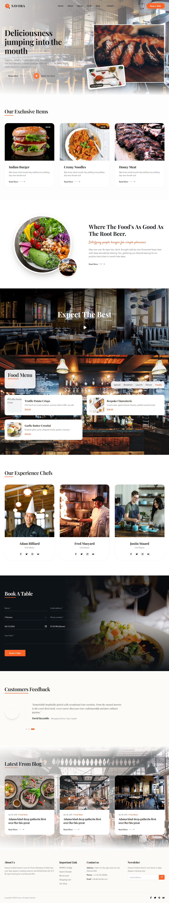

# Savora — Fine Dining & Artisanal Culinary Experience



**Savora** is a modern, responsive web application designed for an upscale artisanal restaurant. The platform showcases culinary artistry through a curated menu, chef profiles, culinary stories, and a streamlined online table reservation system.

---

## 💻 Programming Languages & Technologies

This project is built using modern, production-grade web technologies:

| Category | Technology | Description |
| :--- | :--- | :--- |
| **Primary Language** | **TypeScript** (`~5.8`) | Strict type safety for data models, React components, state handlers, and props |
| **Core Scripting** | **JavaScript** (ESM / ES2022+) | Modern asynchronous execution and module architecture |
| **Markup** | **HTML5** | Accessible, semantic web structure and meta tag standards |
| **Styling** | **CSS3** / **Tailwind CSS v4** | Utility-first styling with `@tailwindcss/vite`, dynamic color variables, and fluid typography |
| **UI Library** | **React 19** | Declarative component hierarchy, functional hooks (`useState`, `useEffect`), and reactive UI updates |
| **Animation Engine** | **Motion** (`motion/react`) | Fluid layout animations, spring physics, scroll-linked progress bars, and modal transitions |
| **Icons** | **Lucide React** | Clean, accessible vector icons matching contemporary design standards |
| **Build Tool** | **Vite 6** | Ultra-fast development server with Hot Module Replacement and production bundling |

---

## ✨ Project Features

### 1. Navigation & Header
- **Dynamic Reading Progress Bar**: Real-time spring-physics progress bar indicating scroll depth across the page.
- **Interactive Section Anchoring**: Smooth auto-scrolling to all sections (`Home`, `About`, `Menu`, `Chefs`, `Blog`, `Contact`).
- **Prominent "Book a Table" Action**: High-contrast, brand-accented call-to-action button in both desktop and mobile headers.
- **Responsive Mobile Drawer**: Optimized touch menu for phones and tablets.

### 2. Atmospheric Hero Section
- **Visual Dining Presentation**: Crisp dining atmosphere backdrop framing high-resolution steak and spice compositions.
- **Action Triggers**: Quick-access reservation button and an interactive *"Watch Our Story"* video player modal.

### 3. About & Heritage Section
- **Brand Storytelling**: Highlights the restaurant's historical roots, sourcing philosophy, and devotion to artisanal food preparation.
- **Culinary Accents**: High-definition plating photography paired with signature dish guarantees.

### 4. Exclusive Signature Dishes
- **Curated Specialties**: Highlights top chef recommendations (e.g., Indian Burgers, Creamy Truffle Pasta).
- **Interactive Cards**: Micro-interactions with price badges, ingredient highlights, and detail previews.

### 5. Interactive Food Menu
- **Category Navigation**: Seamless switching between meal categories:
  - *Special*
  - *Breakfast*
  - *Lunch*
  - *Dinner*
  - *Sneaks (Snacks)*
- **Live Filtering**: Animated tab transitions using Motion `layoutId` arrows for category indicators.
- **Rich Dish Data**: Item names, appetizing descriptions, prices, and high-quality photography.

### 6. Master Chefs Showcase
- **Culinary Team Profiles**: Dedicated presentation of Executive Chefs and Pastry Masters.
- **Social & Specialty Badges**: Visual indicators for signature culinary styles and accolades.

### 7. Online Table Reservation System
- **Interactive Booking Modal & Form**: Accessible from the header, hero button, or inline reservation section.
- **Form Controls**:
  - Full Name & Contact Email
  - Party Size selector (1 to 8+ guests)
  - Booking Date & Time slot selectors
  - Special dietary requests / comments
- **Confirmation State**: Instant animated booking confirmation with simulated guest reservation summary.

### 8. Culinary News & Blog Section
- **Engaging Editorial Grid**: Latest news, culinary guides, and secret recipes.
- **Full Story Reader Modal**: Interactive modal allowing visitors to read full articles without leaving the page.

### 9. Footer & Quick Contacts
- **Operating Hours**: Clear lunch and dinner schedules for weekdays and weekends.
- **Location & Booking Hotlines**: One-click phone and email links, along with interactive newsletter subscription feedback.

---

## 📁 Project Structure

```
├── index.html              # HTML5 entry document with viewport and SEO meta tags
├── metadata.json           # Application identity, name, and permissions
├── package.json            # Node.js dependencies, scripts, and package manifests
├── vite.config.ts          # Vite build tool and Tailwind CSS plugin configuration
├── tsconfig.json           # TypeScript compilation settings
├── src/
│   ├── main.tsx            # Application DOM mounting point
│   ├── App.tsx             # Primary layout orchestrator and state coordinator
│   ├── index.css           # Global Tailwind CSS imports and font directives
│   ├── types.ts            # TypeScript interfaces (MenuItem, Chef, BlogPost, Reservation)
│   ├── data.ts             # Centralized restaurant data, menus, team, and blog posts
│   ├── images.ts           # Centralized image registry for high-resolution photography
│   └── components/
│       ├── Navbar.tsx             # Header navigation, progress bar, and mobile drawer
│       ├── Hero.tsx               # Hero banner, call-to-action buttons, and video trigger
│       ├── HistorySection.tsx     # Restaurant heritage and origin story
│       ├── ExclusiveDishes.tsx    # Signature chef specials showcase
│       ├── FoodMenu.tsx           # Category-based food menu with live filtering
│       ├── VideoBanner.tsx        # Atmospheric video trigger with modal playback
│       ├── ChefsSection.tsx       # Chef profile cards and culinary credentials
│       ├── ReservationSection.tsx # Inline table reservation booking form
│       ├── ReservationModal.tsx   # Overlay modal reservation dialog
│       ├── BlogSection.tsx        # Culinary news and articles grid
│       ├── BlogDetailModal.tsx    # Full article reader modal
│       ├── Footer.tsx             # Contact details, schedule, newsletter, and links
│       └── Icons.tsx              # Brand logo, spoon arrows, and section headings
```

---

## 🚀 Getting Started

### Prerequisites
- **Node.js** (v18.0.0 or higher recommended)
- **npm** or compatible package manager

### Installation

1. Clone or extract the project repository.
2. Install all dependencies:
   ```bash
   npm install
   ```

### Running Locally

Start the local development server:
```bash
npm run dev
```
The application will be accessible at `http://localhost:3000`.

### Building for Production

To create an optimized production build:
```bash
npm run build
```
The compiled static assets will be output to the `dist/` directory.

### Code Quality & Validation

Validate TypeScript types without emitting files:
```bash
npm run lint
```

---

## 🎨 Design System

- **Palette**: Warm neutrals (`#fdfbf8`, `#fbf9f6`, `#ffffff`), deep charcoal typography (`#1a1a1a`, `#444444`, `#777777`), and vibrant culinary orange accents (`#ff6426`, `#ff7a3d`).
- **Typography**: Paired serif headings (Playfair Display / Merriweather aesthetic) with clean sans-serif body text.
- **Accessibility**: High color contrast (WCAG AA compliant), clear focus states, and responsive touch targets (minimum 44px on mobile).
